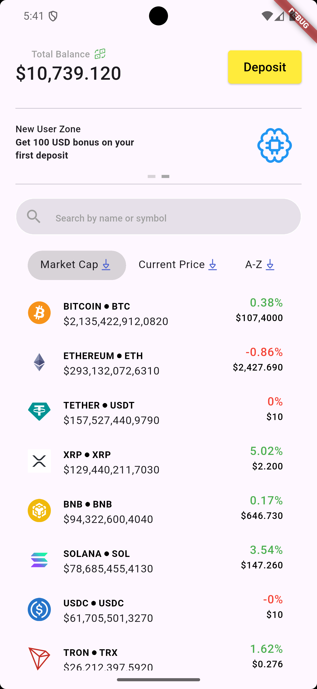
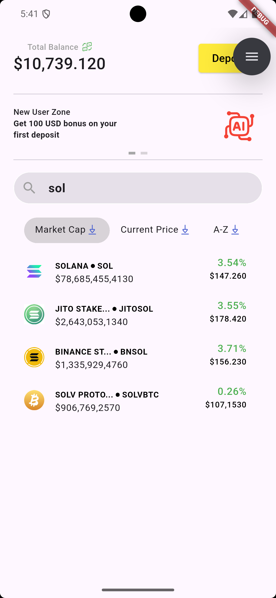
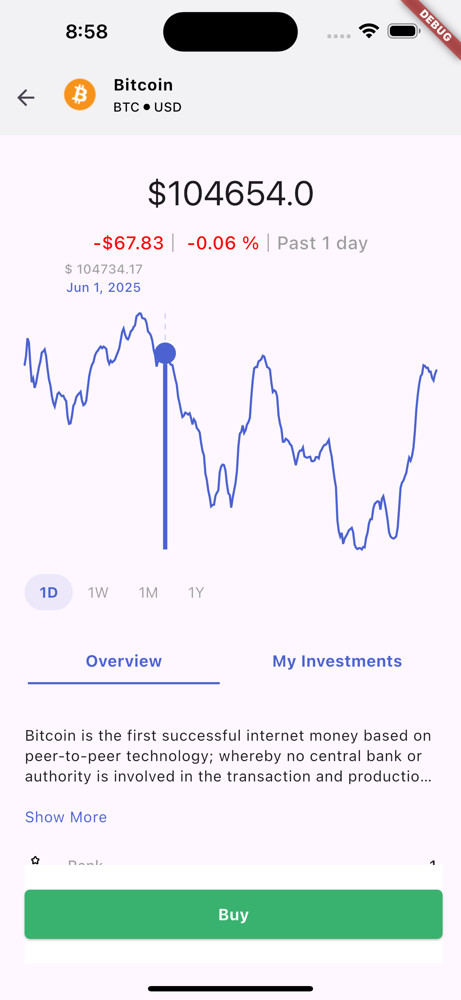
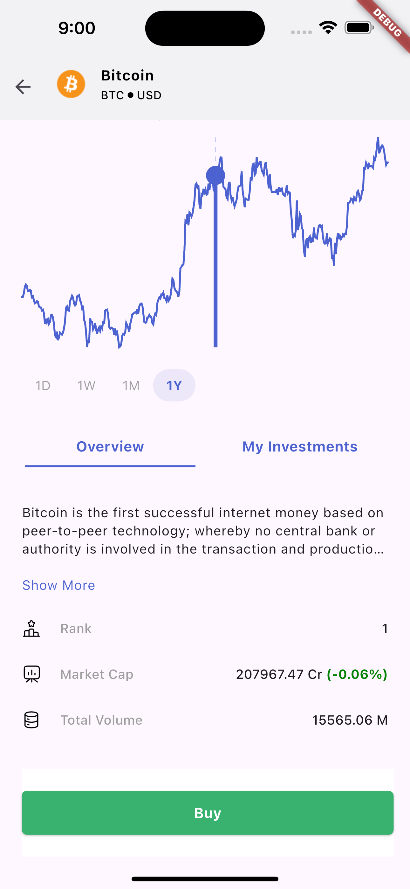
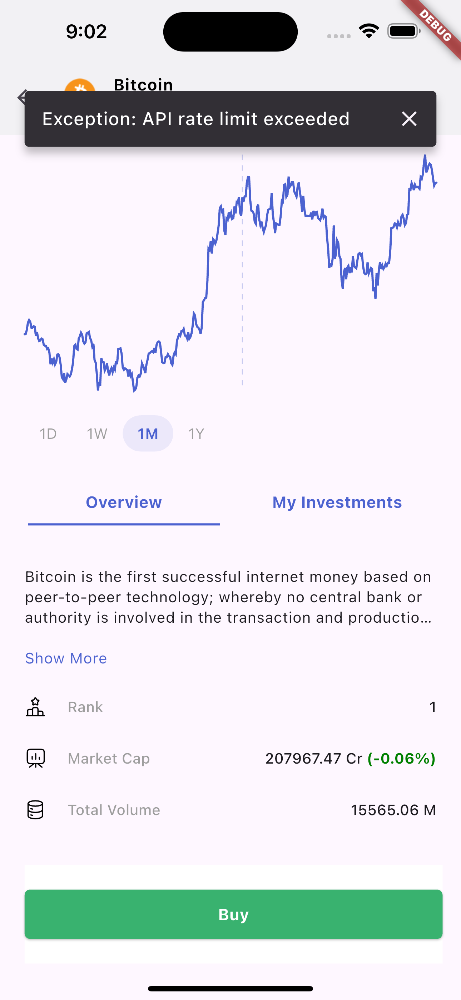
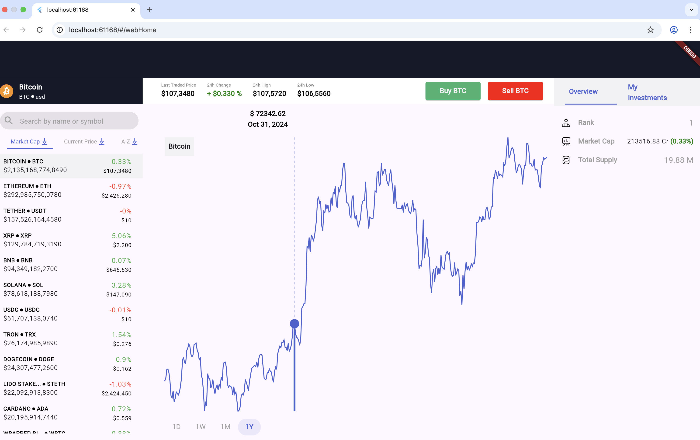
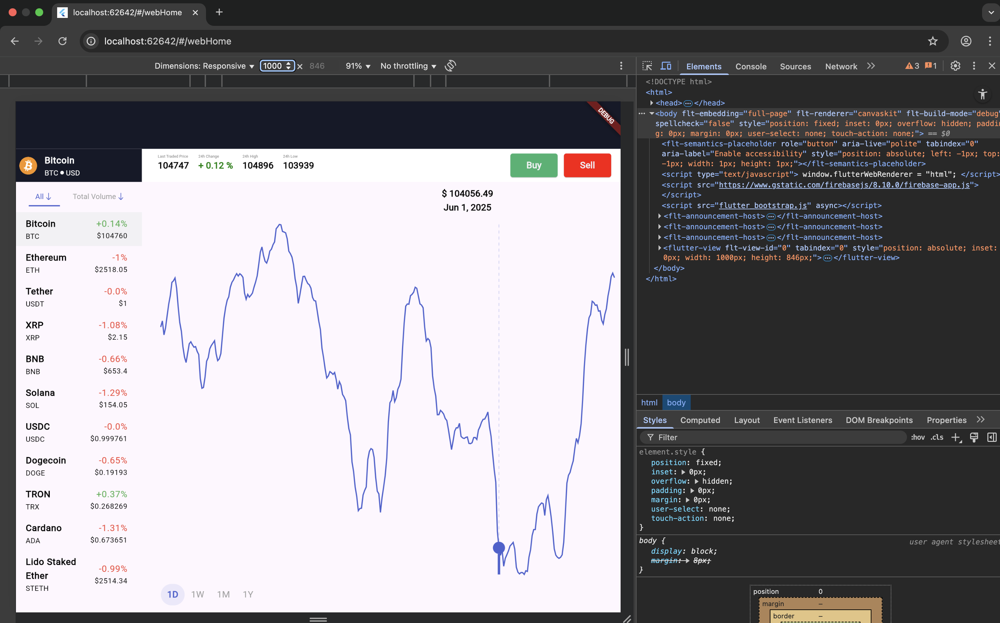
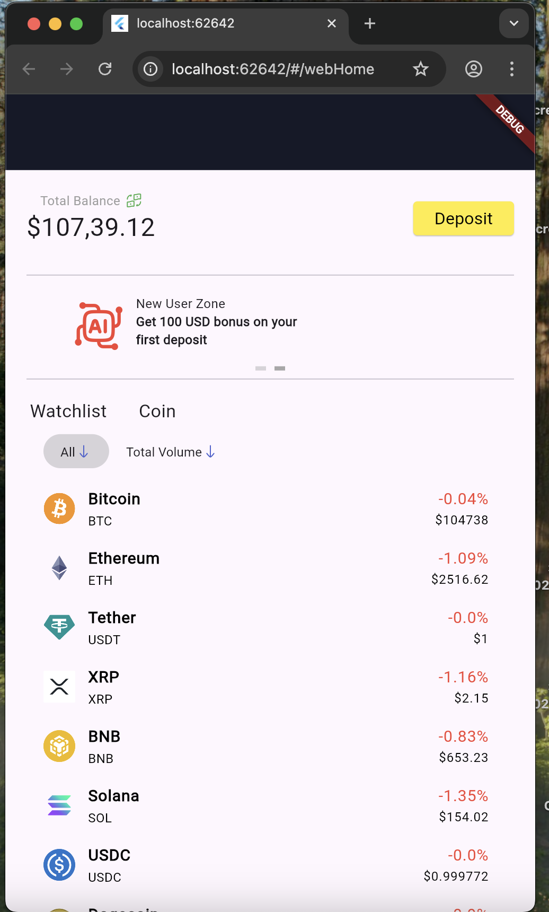
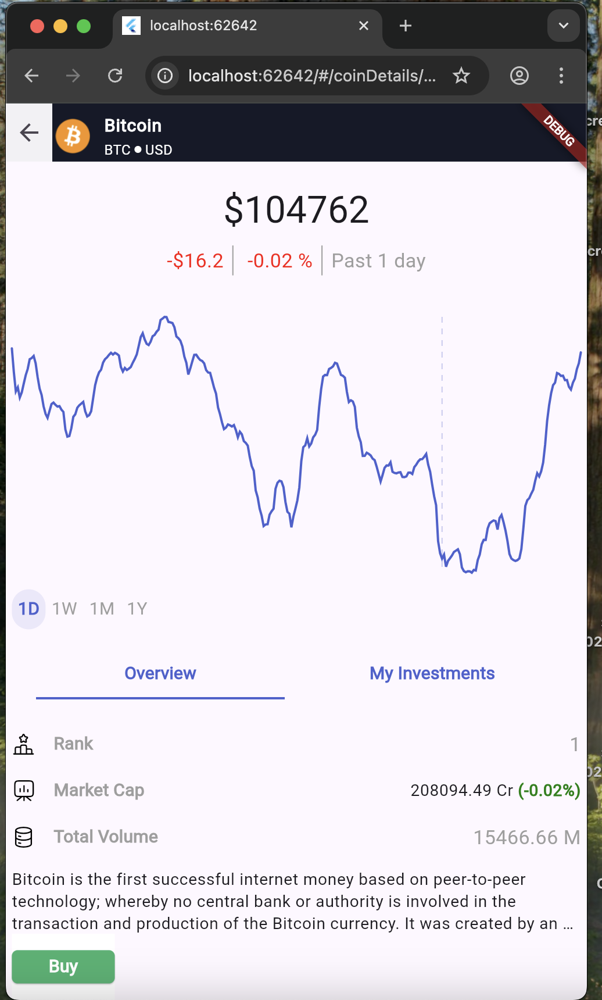

# CoinGecko Web Application

A modern cryptocurrency tracking application built with Flutter, inspired by CoinDCX's trading interface.

## 🚀 Getting Started

### Prerequisites

- Flutter SDK (latest stable version)
- Dart SDK (latest stable version)
- VS Code or Android Studio
- Git

## 📱 Mobile Screenshots

<table style="width: 100%; text-align: center; border-collapse: collapse;">
  <tr>
    <td>Mobile Dashboard Market Cap Descending</td>
    <td>Mobile Dashboard Market Cap Ascending</td>
    <td>Mobile Coin Details Page</td>
  </tr>
  <tr>
    <td></td>
    <td></td>
    <td></td>
  </tr>
  <tr>
    <td>Mobile Coin Market Chart with Tooltip</td>
    <td>Mobile Coin View with Description</td>
    <td>Mobile Error State</td>
  </tr>
  <tr>
    <td></td>
    <td></td>
    <td></td>
  </tr>
</table>

## 🖥️ Web ScreenShots

<table style="width: 100%; text-align: center; border-collapse: collapse;">
  <tr>
    <td colspan="2">Web Main Dashboard Page</td>
  </tr>
  <tr>
    <td colspan="2">
      
    </td>
  </tr>
  <tr>
    <td colspan="2">Web Main Dashboard Page - 1000 width</td>
  </tr>
  <tr>
    <td colspan="2">
      
    </td>
  </tr>
  <tr>
    <td style="width: 50%;">Web Mobile Width</td>
    <td style="width: 50%;">Web Mobile Coin Details Screen</td>
  </tr>
  <tr>
    <td>
      
    </td>
    <td>
      
    </td>
  </tr>
</table>

### Setup Instructions

1. Clone the repository:

```bash
git clone ["https://github.com/abhinav503/CoinGecko.git"]
cd CoinGecko
```

2. Install dependencies:

```bash
flutter pub get
```

3. Configure environment variables:
   The application requires the following environment variables:

- `BASE_URL`: https://api.coingecko.com/api/v3/
- `COINGECKO_API_KEY`: Your CoinGecko API key

4. Run the application:

```bash
flutter run -d chrome
```

## 🏗️ Project Structure

The project follows Clean Architecture principles and Atomic Design methodology:

```
lib/
├── core/
│   ├── constants/
│   ├── ui/
│   │   ├── atoms/
│   │   ├── molecules/
│   │   └── organisms/
│   └── utils/
├── feature/
│   ├── home/
│   ├── web_home/
│   └── coin_details/
└── main.dart
└── routes.dart
```

### Architecture Overview

- **Clean Architecture**: Separation of concerns with distinct layers (presentation, domain, data)
- **Atomic Design**: UI components organized as atoms, molecules, and organisms
- **BLoC Pattern**: State management using Flutter BLoC
- **Reusable Widgets**: ReUsable Widget Across Web/Mobile

## 🛠️ Technology Stack

### Framework & Libraries

- **Flutter**: Cross-platform UI framework
  - Chosen for its performance, hot reload capability, and single codebase for multiple platforms
- **flutter_bloc**: State management
  - Provides predictable state management and separation of concerns
- **fl_chart**: Charting library
  - Open-source, free, and highly customizable
  - Excellent performance with large datasets
- **flutter_screenutil**: Responsive UI
  - Ensures consistent UI across different screen sizes

## 🎨 Design Inspiration

The application's UI is inspired by [CoinDCX](https://coindcx.com/trade/MOGUSDT), featuring:

- Clean and modern interface
- Real-time price updates
- Interactive charts
- Responsive layout

## 📊 Chart Implementation

- **Library**: fl_chart
- **Features**:
  - Real-time price updates
  - Interactive zoom and pan
  - Multiple timeframe support
  - Custom styling and themes

## ⚠️ Known Issues & Assumptions

### Assumptions

- Market Coin API returns duplicate values in ascending order
- Coin Details Screen price changes are limited to 24-hour data
- API rate limits and response times

### Areas for Improvement

- [ ] Enhanced UI/UX with more data visualization
- [ ] Additional chart timeframes
- [ ] Portfolio tracking features
- [ ] Advanced trading indicators
- [ ] Real-time notifications
- [ ] Dark mode support
- [ ] Mobile responsiveness improvements

## 🤝 Contributing

Contributions are welcome! Please feel free to submit a Pull Request.

## 📝 License

This project is licensed under the MIT License - see the LICENSE file for details.
