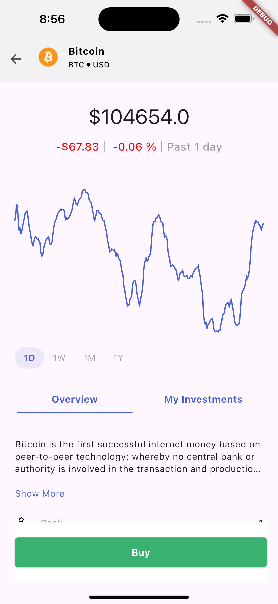

# CoinGecko Web Application

A modern cryptocurrency tracking application built with Flutter, inspired by CoinDCX's trading interface.

## 🚀 Getting Started

### Prerequisites

- Flutter SDK (latest stable version)
- Dart SDK (latest stable version)
- VS Code or Android Studio
- Git

### Command To run Code in Debug Mode

```bash
flutter run \
 --dart-define=BASE_URL=https://api.coingecko.com/api/v3/ \
 --dart-define=COINGECKO_API_KEY=CG-DZYGA8WkGNWJmL6afuToJ3Ct
```

## ✅ All Features Implemented

### 🌐 Common Across Web & Mobile

- ✅ Fully responsive design for desktop, and mobile screens.
- 🎨 UI styling inspired by **CoinDCX** for modern and intuitive layout.
- ⚠️ Robust error handling for all API calls to ensure graceful failure states.

---

### 📊 Dashboard Page

- Fetches and displays **10–25 cryptocurrencies** using the [`/coins/markets`](https://www.coingecko.com/api/documentations/v3#/coins/get_coins_markets) endpoint.
- Each coin shows:
  - **Name**
  - **Symbol**
  - **Current Price (USD)**
  - **Market Cap**
  - **24h Price Change (%)**
- 🔁 **Sorting functionality**: Toggle between ascending and descending market cap.
- 💰 **Static total balance** and a **banner section** to enhance layout spacing.
- ➡️ Clicking a coin navigates to its **Coin Detail Page**.

---

### 📄 Coin Details Page

- Displays data from the [`/coins/{id}`](https://www.coingecko.com/api/documentations/v3#/coins/get_coins__id_) endpoint:
  - **Name**, **Symbol**, **Current Price**, **Market Cap**
  - 📖 A brief **description**
- 📈 **Line chart** using [`fl_chart`](https://pub.dev/packages/fl_chart):
  - Visualizes price history over **7 or 30 days**
- 🔙 Easy navigation back to the Dashboard Page.

---

### ✨ Bonus Features

- 🧭 **Interactive chart features**:
  - Hover tooltips showing date and price
  - Switchable time range (7d / 30d)
- 📜 **Pagination / Infinite Scrolling**:
  - Efficient loading for large lists

## 📱 Mobile Screenshots

<table style="width: 100%; text-align: center; border-collapse: collapse;">
  <tr>
    <td>Mobile Dashboard Market Cap Descending</td>
    <td>Mobile Dashboard Market Cap Ascending</td>
    <td>Mobile Coin Details Page</td>
  </tr>
  <tr>
    <td></td>
    <td></td>
    <td></td>
  </tr>
  <tr>
    <td>Mobile Coin Market Chart with Tooltip</td>
    <td>Mobile Coin View with Description</td>
    <td>Mobile Error State</td>
  </tr>
  <tr>
    <td></td>
    <td></td>
    <td></td>
  </tr>
</table>

## 🖥️ Web ScreenShots

<table style="width: 100%; text-align: center; border-collapse: collapse;">
  <tr>
    <td colspan="2">Web Main Dashboard Page</td>
  </tr>
  <tr>
    <td colspan="2">
      
    </td>
  </tr>
  <tr>
    <td colspan="2">Web Main Dashboard Page - 1000 width</td>
  </tr>
  <tr>
    <td colspan="2">
      
    </td>
  </tr>
  <tr>
    <td style="width: 50%;">Web Mobile Width</td>
    <td style="width: 50%;">Web Mobile Coin Details Screen</td>
  </tr>
  <tr>
    <td>
      
    </td>
    <td>
      
    </td>
  </tr>
</table>

### Setup Instructions

1. Clone the repository:

```bash
git clone ["https://github.com/abhinav503/CoinGecko.git"]
cd CoinGecko
```

2. Install dependencies:

```bash
flutter pub get
```

3. Configure environment variables:
   The application requires the following environment variables:

- `BASE_URL`: https://api.coingecko.com/api/v3/
- `COINGECKO_API_KEY`: Your CoinGecko API key

4. Run the application:

```bash
flutter run -d chrome
```

## 🏗️ Project Structure

The project follows Clean Architecture principles and Atomic Design methodology:

```
lib/
├── core/
│   ├── constants/
│   ├── ui/
│   │   ├── atoms/
│   │   ├── molecules/
│   │   └── organisms/
│   └── utils/
├── feature/
│   ├── home/
│   ├── web_home/
│   └── coin_details/
└── main.dart
└── routes.dart
```

### Architecture Overview

- **Clean Architecture**: Separation of concerns with distinct layers (PRESENTATION, DOMAIN, DATA)
- **Atomic Design**: UI components organized as ATOMS, MOLECULES, and ORGANISMS & TEMPLATES
- **BLoC Pattern**: State management using Flutter BLoC
- **Reusable Widgets**: ReUsable Widget Across Web/Mobile

## 🛠️ Technology Stack

### Framework & Libraries

- **Flutter**: Cross-platform UI framework
  - Chosen for its performance, hot reload capability, and single codebase for multiple platforms
- **flutter_bloc**: State management
  - Provides predictable state management and separation of concerns
- **fl_chart**: Charting library
  - Open-source, free, and highly customizable
  - Excellent performance with large datasets
- **flutter_screenutil**: Responsive UI
  - Ensures consistent UI across different screen sizes
- **get_it**: Dependency Injection

## 🎨 Design Inspiration

The application's UI is inspired by [CoinDCX](https://coindcx.com/trade/MOGUSDT), featuring:

- Clean and modern interface
- Real-time price updates
- Interactive charts
- Responsive layout

## 📊 Chart Implementation

- **Library**: fl_chart
- **Features**:
  - Real-time price updates
  - Interactive zoom and pan
  - Multiple timeframe support
  - Custom styling and themes

## ⚠️ Known Issues & Assumptions

- Market Coin API returns duplicate values in ascending order
- Coin Details Screen price changes are limited to 24-hour data for free tier
- API rate limits and response times
- Static Data on few instances

### Wanted To Do But Could Do because of Time Crunch

- [ ] Enhanced UI/UX with more data visualization
- [ ] Additional chart timeframes
- [ ] Advanced trading indicators
- [ ] Real-time notifications
- [ ] Dark mode support
